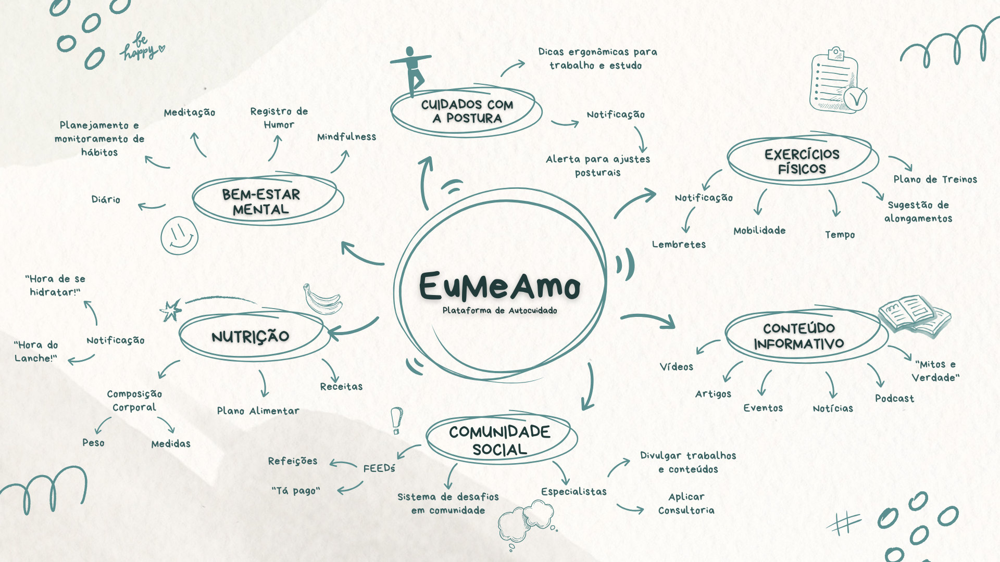

# __Mapa Mental relacionado ao Projeto EuMeAmo__

## __Introdução__

Este documento apresenta o Mapa Mental da Plataforma de autocuidado "Eu Me Amo", uma solução focada no bem-estar e qualidade de vida dos usuários.

## __Mapa Mental__

O Mapa Mental é uma técnica de organização visual do conhecimento, desenvolvida por Tony Buzan na década de 1970. Ele é baseado na forma como o cérebro processa informações, utilizando palavras-chave, conexões e imagens para facilitar a memorização e o entendimento de conceitos complexos.

O __Mapa Mental 1__ foi elaborado pelo grupo com base nas discurssões realizadas pelos integrantes do grupo,  referênciadas por aplicativos similares, estudos sobre saúde e ergonomia, além de boas práticas de design de experiência do usuário (UX). Ele representa as principais funcionalidades e possibilidades de interação dentro do sistema, ajudando a organizar os requisitos e validar as necessidades dos usuários.

O __Mapa Mental 2__ foi elaborado tendo em vista a visão técnica da plataforma, pensando em aspectos como tipos de usuários, interações, tecnologias a serem utilizadas e etc.

Este documento serve como base para a definição dos requisitos funcionais e não funcionais, garantindo um desenvolvimento alinhado com as necessidades do público-alvo.

__Mapa Mental 1: Universo da Plataforma__

__Autor(es):__ [Felipe Andrade](), [Luiza Maluf](), [Mateus Boquady]() e [Rodrigo Rodrigues]().

__Mapa Mental 2: Visão Técnica__

__Autor(es):__ [Felipe Andrade](), [Luiza Maluf](), [Mateus Boquady]() e [Rodrigo Rodrigues]().

---

## __Gravação da Produção dos artefatos__

<iframe width="560" height="315" src="https://www.youtube.com/embed/pXK2Iw8Cnv0?si=oW9xlyzNsnXVPXlI" title="YouTube video player" frameborder="0" allow="accelerometer; autoplay; clipboard-write; encrypted-media; gyroscope; picture-in-picture; web-share" referrerpolicy="strict-origin-when-cross-origin" allowfullscreen></iframe>

---

## __Refências Bibliográficas__

> BUZAN, Tony. The Mind Map Book: Unlock your creativity, boost your memory, change your life. BBC Active, 2006.

---

## Histórico de Versão

| Versão | Data | Descrição | Autor | Revisor
|:-:|:-:|:-:|:-:|:-:|
|`1.0`| 02/04/2025 | Criação do documento| [LuizaMaluf](https://github.com/LuizaMaluf)| [Lucas Bottino]() |
