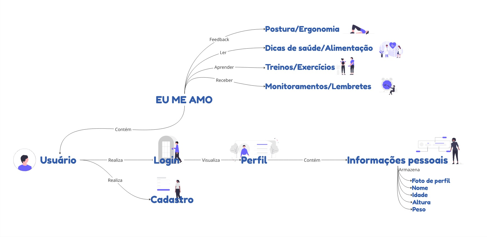
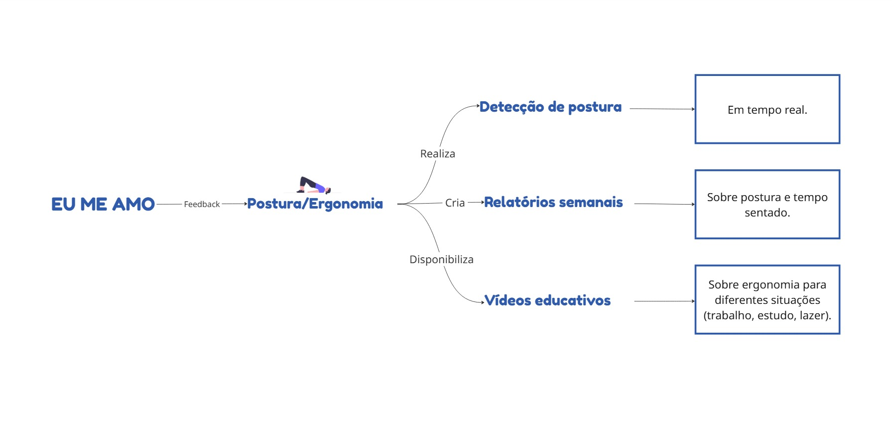
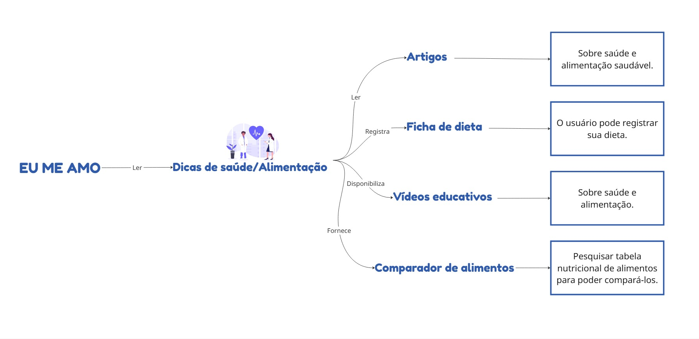
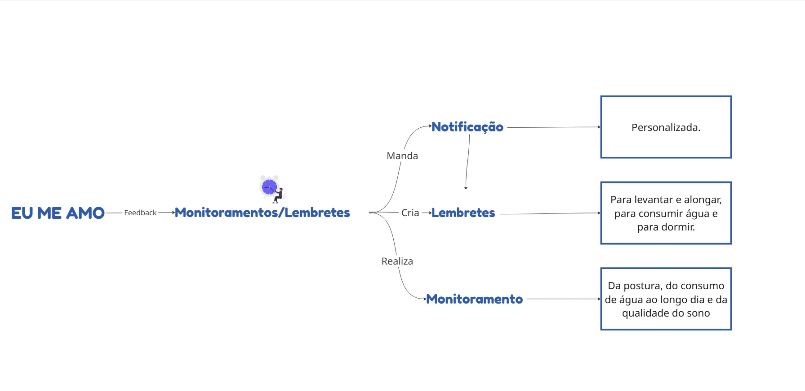
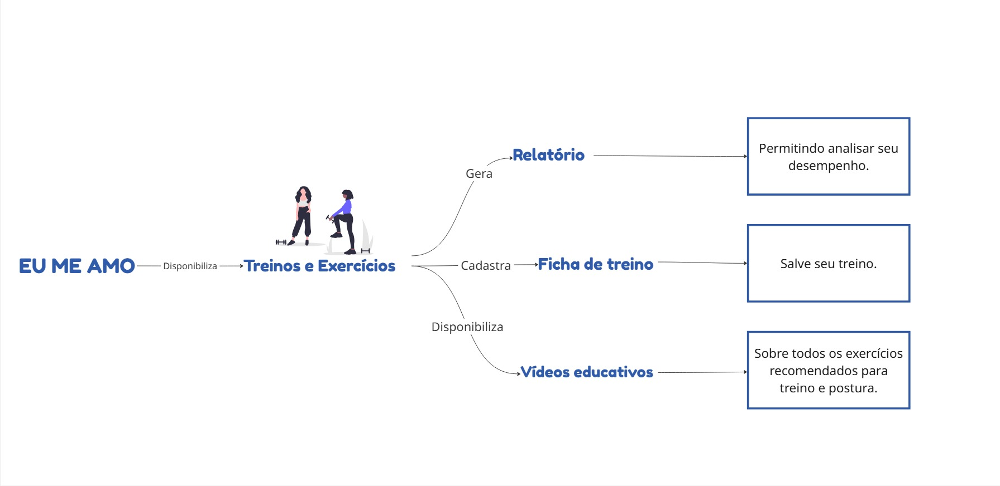

# __Rich Picture__

## __Introdução__

O Rich Picture é uma técnica visual utilizada para representar de forma intuitiva e não estruturada um sistema complexo, suas interações e os problemas envolvidos. Ele consiste em um desenho que combina elementos como pessoas, processos, objetos e relacionamentos, permitindo uma visão holística da situação. Além disso, o Rich Picture ajuda na compreensão e comunicação de cenários complexos, facilitando o alinhamento entre diferentes partes interessadas.

__Sistema principal:__

__Autor(es):__ [Arthur Fonseca](), [Letícia Hladczuk]() e [Gabriel Saraiva]().

__Sistema de Postura/Ergonomia:__

__Autor(es):__ [Arthur Fonseca](), [Letícia Hladczuk]() e [Gabriel Saraiva]().

__Sistema de Dicas de Saúde:__

__Autor(es):__ [Arthur Fonseca](), [Letícia Hladczuk]() e [Gabriel Saraiva]().

__Sistema de Monitoramento/Lembretes:__

__Autor(es):__ [Arthur Fonseca](), [Letícia Hladczuk]() e [Gabriel Saraiva]().

__Sistema de Treinos e Exercícios:__

__Autor(es):__ [Arthur Fonseca](), [Letícia Hladczuk]() e [Gabriel Saraiva]().

## __Rastreabilidade__

- [Reunião 4](../Projeto/Iniciativas%20Extras/ata_04.md)

## __Gravação da criação do Rich Picture__

<iframe width="560" height="315" src="https://youtu.be/nJbmMnCe5Co" title="YouTube video player" frameborder="0" allow="accelerometer; autoplay; clipboard-write; encrypted-media; gyroscope; picture-in-picture; web-share" referrerpolicy="strict-origin-when-cross-origin" allowfullscreen></iframe>

## __Refências Bibliográficas__

> TOLFO, Cristiano. Using rich picture as a didactic resource based on visual thinking. Universidade Federal do Pampa, 2019.

## Histórico de Versão

| Versão | Data | Descrição | Autor | Revisor
|:-:|:-:|:-:|:-:|:-:|
|`1.0`| 07/04/2025 | Criação do Rich Picture | [Arthur Fonseca](https://github.com/arthurfonsecaa), [Letícia Hladczuk](https://github.com/HladczukLe), [Gabriel Saraiva]() | Arthur Fonseca|

