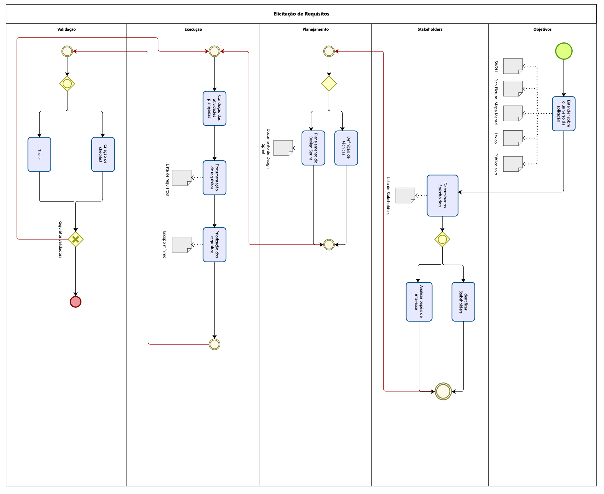
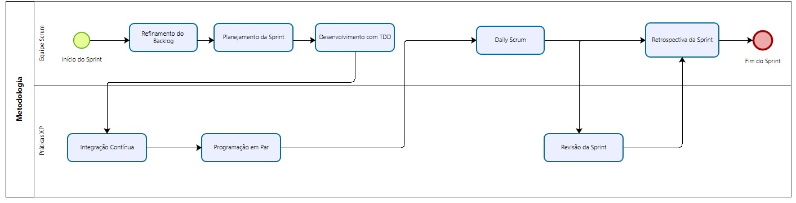

# 1.3. Módulo Modelagem BPMN

## __Introduçao__

A BPMN (Business Process Model and Notation) é um jeito padronizado de mostrar processos de negócios usando diagramas visuais. Ela traz um conjunto bem definido de símbolos e regras que ajudam a desenhar os fluxos de atividades com o nível de detalhe que você precisar, dependendo do que o modelo exige.

Com a BPMN, dá pra criar processos novos do zero, melhorar os que já existem e ainda fazer documentos fáceis de compartilhar com o time. Ela também ajuda bastante a organizar fluxos de trabalho, identificar o que um software precisa (principalmente na área de TI) e até automatizar processos operacionais.

O grande lance da BPMN é que ela deixa tudo mais claro com uma visão gráfica dos fluxos de tarefas, facilitando entender como os processos empresariais funcionam. Assim, fica simples enxergar cada etapa, apontar quem faz o quê, captar o funcionamento geral da empresa e ainda destacar o que pode ser ajustado pra ficar melhor.

## __Metodologia__

Este projeto de desenho de software adotará metodologias ágeis, com foco em Scrum e Extreme Programming (XP). O Scrum será utilizado para organizar o trabalho em sprints e promover entregas incrementais, enquanto o XP contribuirá com práticas técnicas como TDD, refatoração contínua e programação em par, garantindo qualidade e flexibilidade. A combinação dessas abordagens permitirá uma evolução contínua do sistema, com foco na colaboração, adaptação e entrega de valor ao cliente.

## Sprint Design

<figcaption align='center'>
    <b>Figura 1: Processo de Sprint Design </b>
</figcaption>
 

 Fonte: [Arthur](https://github.com/arthurfonsecaa), [Lucas](https://github.com/bottinolucas), [Pablo](https://github.com/Pabloserrapxx) 2024.

## Elicitação de Requisitos

<figcaption align='center'>
    <b>Figura 2: Elicitação de Requisitos </b>
</figcaption>
 

 Fonte: [Filipe](https://github.com/fillipeb50), [Luiza](https://github.com/LuizaMaluf), [Rodrigo](https://github.com/rodfon3301) 2024.

## Metodologia

<figcaption align='center'>
    <b>Figura 3: Metodologia </b>
</figcaption>
 

 Fonte: [Carlos](https://github.com/carlinn1), [Gabriel](https://github.com/gabrielsarcan), [Mateus](https://github.com/mateus9levy) 2024.

## Gravações da realização dos diagramas

 Vídeo 1: Produção do BPMN - Elicitação de Requisitos.

<iframe width="560" height="315" src="https://www.youtube.com/embed/033lENt9pqk?si=R3IZTteRWgcHv3lg" title="YouTube video player" frameborder="0" allow="accelerometer; autoplay; clipboard-write; encrypted-media; gyroscope; picture-in-picture; web-share" referrerpolicy="strict-origin-when-cross-origin" allowfullscreen></iframe>

## Histórico de Versão

| Versão | Data | Descrição | Autor | Revisor
|:-:|:-:|:-:|:-:|:-:|
|`1.0`| 09/04/2025 | Criação ModelagemBPMN | [Mateus Levy](https://github.com/mateus9levy) | [Lucas Botinno](https://github.com/bottinolucas) |
|`1.1`| 10/04/2025 | adiciona diagrama metodologia| [Mateus Levy](https://github.com/mateus9levy) | [Lucas Botinno](https://github.com/bottinolucas) |

