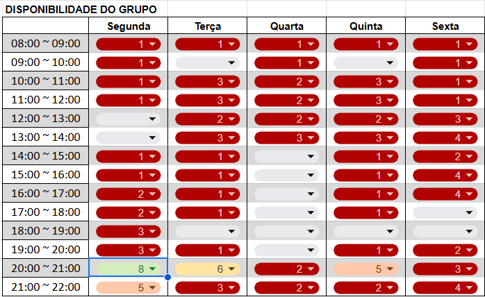

# Heatmap

## Sobre o heatmap

Um heatmap, ou mapa de calor, é uma representação visual de dados em que diferentes cores indicam distintos níveis de intensidade ou valor. Ele funciona como uma ferramenta que evidencia áreas de maior ou menor atividade — por exemplo, mostrando as regiões mais visitadas de um site, os locais mais afetados por uma doença ou as variações de temperatura em um país. Esse tipo de visualização facilita a identificação de padrões, tendências e anomalias, tornando a análise de dados mais clara e eficiente.

No nosso caso, utilizamos o mapa de calor para ilustrar a disponibilidade de tempo dos membros da equipe, levando em conta seus compromissos pessoais, acadêmicos e profissionais. Essa abordagem nos ajuda a organizar reuniões de forma mais estratégica e respeitosa, evitando conflitos de agenda e sobrecarga de tarefas. Com isso, garantimos uma participação mais ativa e colaborativa de todos no projeto, valorizando suas contribuições e habilidades.

## Resultados

Para determinar rapidamente a disponibilidade dos membros da equipe, criamos uma planilha online compartilhada. Nela, cada pessoa registra sua disponibilidade durante a semana, marcando os períodos em que está livre ou ocupado. Com base nessas informações, elaboramos um mapa de calor correspondente.

Tabela 1: Heatmap.

Fonte: [Pablo S. Carvalho](https://github.com/Pabloserrapxx), 2025.

Com base nas informações da tabela acima, definimos que os encontros serão idealmente realizados às segundas às 21h. Este horário foi mais apropriados para a maior parte dos integrantes do grupo, levando em conta suas disponibilidades e obrigações. Ademais, esses intervalos nos oferecem a oportunidade adequada para debater os temas importantes para o nosso projeto.

## Bibliografia

> 1. neil patel. Disponível em: [https://neilpatel.com/br/blog/heatmap-o-que-e/](https://neilpatel.com/br/blog/heatmap-o-que-e/). Acesso em: 8 de Abriu. de 2025.

## Histórico de Versões

| Versão |    Data    |      Descrição       |                      Autor                       | Revisor |
| :----: | :--------: | :------------------: | :----------------------------------------------: | :-----: |
| `1.0`  | 08/04/2025 |  Criação do documento | [Pablo Serra](https://github.com/Pabloserrapxx) |  [Lucas Bottino](https://github.com/bottinolucas)   |

