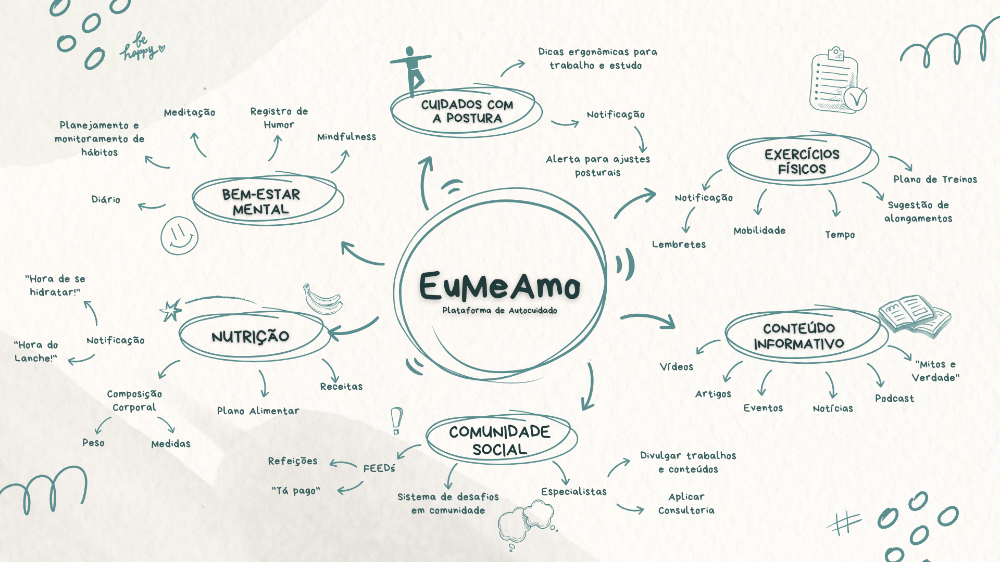

# 2025.1(T01)_G3_EuMeAmo_Entrega_01

**Código da Disciplina**: FGA0208 
**Número do Grupo**: 03 
**Entrega**: 01 

## Alunos

| Foto  | Matrícula  | Aluno         |
|-------|-----------|--------------|
|  | 221031120 | Arthur Fonseca Vale |
|  | 211061529 | Carlos Henrique de Souza Bispo |
|  | 190087188 | Fillipe Souto de Andrade |
|  | 202045769 | Gabriel Saraiva Canabrava |
|  | 221039209 | Letícia de Cássia Hladczuk Rodrigues |
|  | 221008267 | Lucas Gama De Araujo Bottino |
|  | 221008294 | Luiza Maluf Amorim |
|  | 190113901 | Mateus Levy Avelans Boquady |
|  | 221008679 | Pablo Serra Carvalho |
|  | 211062722 | Rodrigo Fonseca Rodrigues |

## Sobre 
Projeto G3 - Eu Me Amo, baseado em sites e/ou materiais informativos sobre cuidados gerais com postura, exercícios físicos regulares, e outros. Pode ser em versão site, desktop ou aplicativo móvel.

## Screenshots da Primeira Entrega
Adicione 2 ou mais screenshots em termos de artefatos realizados na entrega.

__Mapa Mental 1: Universo da Plataforma__

## Há algo a ser executado?

( ) SIM

( ) NÃO

Se SIM, insira um manual (ou um script) para auxiliar ainda mais os interessados na execução.

## Informações Complementares 
Quaisquer outras informações adicionais podem ser descritas nessa seção.

## Histórico de Versões

| Versão | Data | Descrição | Autor(es) | Revisor(es) | Detalhes da revisão |
| :----: | :--: | --------- | ----------- | ------ | :---: |
| 1.0  | 01/04/2025 | Criação do documento |Carlos Henrique  |  | |